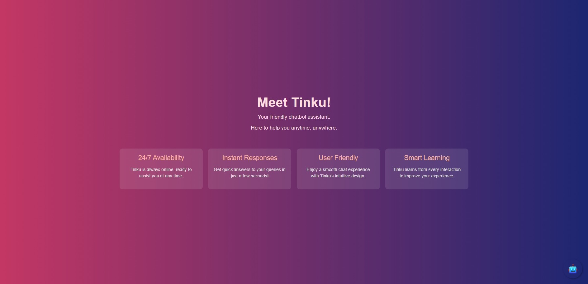
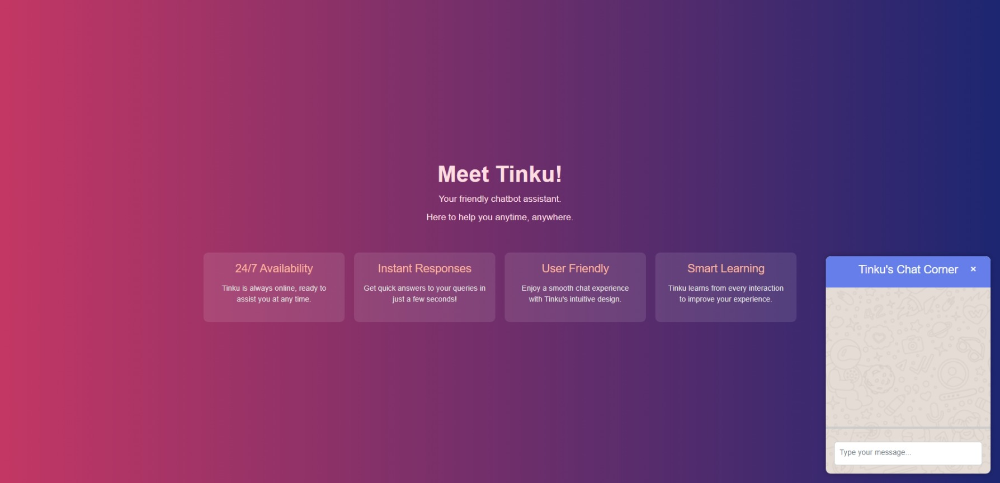

# MrTinku - Your Friendly Chatbot

Welcome to **MrTinku**, a Django-based chatbot application that utilizes the OpenAI and ChatGPT API to provide instant responses and assistance to users. Tinku is designed to offer a seamless chatting experience, making it easy for users to interact and get the help they need.

## Features

- **24/7 Availability**: Tinku is always online and ready to assist you at any time.
- **Instant Responses**: Get quick answers to your queries within seconds.
- **User Friendly**: Enjoy a smooth and intuitive chat experience.
- **Smart Learning**: Tinku learns from every interaction to enhance user experience.

## Configuration

Before running the project, you need to set up your environment variables. Create a `.env` file in the root directory of the project and add your OpenAI API key as follows:

## Getting Started

Follow these steps to set up and run the application:

1. **Create a Virtual Environment**

```bash
python -m venv myenv
```

2. **Activate the Virtual Environment**

```bash
myenv\Scripts\activate
```

3. **Install Required Packages**

```bash
pip install django openai python-dotenv
```

4. **Set Up API**
    - Replace `your_api_key_here` with your actual OpenAI API key
    - Add your API key to views.py and api.env

5. **Run the Application**

```bash
python manage.py runserver
```

## Pages Overview

### 1. Home Page


### 2. ChatBot


 
*Chatbot Interface Screenshot*

## Demo Video

Watch the demo video to see Tinku in action:

  

## How It Works

1. **Chat Page**: The main chat page is served via Django views and includes an interactive chat interface.
2. **OpenAI Integration**: The application connects to the OpenAI API using your API key (stored securely in a `.env` file) to handle user queries.
3. **Chatbot Response**: User messages are sent to the OpenAI API, which generates appropriate responses that are displayed in the chat window.

## Usage

1. Run the Django server.
2. Access the chatbot interface in your web browser.
3. Start chatting with Tinku!

## Contributing

Contributions are welcome! If you'd like to contribute, please fork the repository and create a pull request.

## Acknowledgments

- [OpenAI](https://openai.com/) for their powerful API.
- [Django](https://www.djangoproject.com/) for the robust web framework.
- All contributors for their support and feedback.
